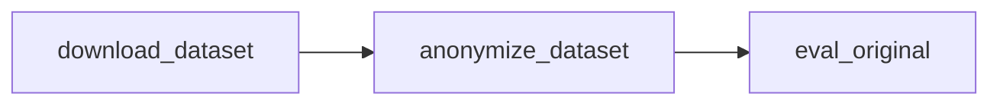

# PrivScreen Experiment Code Map

This document describes which code in **`PrivScreen_evaluation/`** is responsible for **downloading the PrivScreen dataset**, **masking screenshots with `PrivacyProtectionLayer`**, and **evaluating the processed data**, for reproduction and navigation.

Expected clone layout: `gui_privacy_protection/PrivScreen_evaluation/` next to `gui_privacy_protection/AndLab_protected/` (privacy implementation).

---

## 1. Overall workflow and corresponding code

| Step | Purpose | Main code location |
|------|---------|---------------------|
| 1. Download dataset | Download PrivScreen from Hugging Face to a local directory | [`download_dataset.py`](download_dataset.py) |
| 2. Anonymization | OCR + NER + masking per screenshot via `PrivacyProtectionLayer`; output preserves directory layout | [`anonymize_dataset.py`](anonymize_dataset.py) + [`../AndLab_protected/utils_mobile/privacy_protection.py`](../AndLab_protected/utils_mobile/privacy_protection.py) (shim → `utils_mobile/privacy/`) |
| 3. Evaluation | VQA on processed images; privacy leakage rate, normal QA accuracy, text metrics | [`eval_original.py`](eval_original.py) + [`config.py`](config.py), [`dataset.py`](dataset.py), [`api_client.py`](api_client.py), [`utils.py`](utils.py) |

---

## 2. Step 1: Download dataset

### File: [`download_dataset.py`](download_dataset.py)

- **Purpose**: Download the PrivScreen dataset from Hugging Face into a chosen directory.
- **Key content**:
  - `download_with_huggingface_hub(repo_id, target_dir)`: uses `huggingface_hub.snapshot_download` (recommended).
  - `download_with_git(repo_id, target_dir)`: fallback using `git clone`.
  - Defaults: `repo_id='fyzzzzzz/PrivScreen'`, target from CLI (`--target`, often `./data`).
  - If `HF_ENDPOINT` is not already set in the environment, the script sets a default mirror (`https://hf-mirror.com`); export `HF_ENDPOINT` yourself to use the public Hugging Face hub or another mirror.
- **Dependencies**: `huggingface_hub` (or `git` for fallback).
- **Usage**:  
  `python download_dataset.py --target ./data`  
  After download, layout is typically `./data/{app}/images/*.png` plus `privacy_qa.json` and `normal_qa.json` per app, or a nested `./data/privscreen/...` depending on the dataset snapshot—point `--source` at the directory that actually contains the app folders.

---

## 3. Step 2: Process PrivScreen with `PrivacyProtectionLayer`

### 3.1 Script: [`anonymize_dataset.py`](anonymize_dataset.py)

- **Purpose**: Walk all files under a source tree, anonymize images with **`PrivacyProtectionLayer`**, write to `output_dir` preserving relative paths; non-images are copied as-is.
- **Path to AndLab**: Prepends `ANDLAB_PROTECTED_ROOT` if set, otherwise `../AndLab_protected` relative to this file. Raises if that directory is missing.
- **Key functions**:
  - `get_all_files(source_dir)`: returns `(relative_path, absolute_path)` for every file.
  - `anonymize_dataset(source_dir, output_dir, privacy_layer=None)`: if `privacy_layer` is omitted, constructs `PrivacyProtectionLayer(enabled=True)`; for each image calls `identify_and_mask_screenshot_with_timing` and writes outputs.
- **Default CLI** (see script `--help`): e.g. `--source` / `--output`; use a source path that matches your download layout (`./data` or `./data/privscreen`).

### 3.2 Privacy implementation: [`../AndLab_protected/utils_mobile/privacy_protection.py`](../AndLab_protected/utils_mobile/privacy_protection.py)

- **Purpose**: Shim re-exporting the token anonymization layer and related APIs from `utils_mobile/privacy/` (see [PRIVACY_PROTECTION_LAYER_DOCUMENTATION.md](../AndLab_protected/PRIVACY_PROTECTION_LAYER_DOCUMENTATION.md)).
- **API used here**:
  - `PrivacyProtectionLayer(enabled=True)`.
  - `identify_and_mask_screenshot_with_timing(image_path)` → `((masked_image_path, tokens), timing_dict)` with timing fields such as `ocr_time`, `ner_time`, `total_time`.

---

## 4. Step 3: Evaluate the processed dataset

### 4.1 Entry: [`eval_original.py`](eval_original.py)

- **Purpose**: Evaluate **processed** images (no extra perturbation). Reads images and QA JSONs, runs a surrogate VQA model (local or API), uses an LLM field extractor for structured privacy fields, and computes leakage / QA metrics.
- **Key pieces**:
  - `LLMFieldExtractor`: OpenAI-compatible API for JSON field extraction (API key from args or `OPENAI_API_KEY`). Effective extractor model name comes from CLI **`--extractor-model`** (default `gpt-4o-mini` in `argparse`), not the class default if you only use `main()`.
  - `OriginalEvaluator`: loads config/dataset, `evaluate(dataset, output_path)`, optional `--use-api` for VQA APIs.
- **CLI highlights**: `--data-root`, `--output`, `--app`, `--normal-judge`, `--use-api`, `--vqa-*`, `--extractor-*`. Prefer environment variables for secrets; do not commit API keys.

### 4.2 Dataset: [`dataset.py`](dataset.py)

- **Purpose**: `PrivacyProtectionDataset` for PrivScreen layout: `data_root/{app}/images/` plus `privacy_qa.json` and `normal_qa.json`. `collate_fn` for `DataLoader`.

### 4.3 Config: [`config.py`](config.py)

- **Purpose**: `Config` (`data_root`, `image_size`, `train_split_ratio`, `surrogate_model_name`, `device`, …). `eval_original.py` overrides `data_root` when `--data-root` is passed.

### 4.4 API client: [`api_client.py`](api_client.py)

- **Purpose**: `APIClient` for OpenAI-compatible or Gemini-style vision QA when `--use-api` is set.

### 4.5 Text metrics: [`utils.py`](utils.py)

- **Purpose**: `compute_text_metrics` (BERTScore, cosine, BLEU, ROUGE-L, etc.) with lazy imports of optional packages.

---

## 5. Data and path conventions

- **Download output**: e.g. `./data` or `./data/privscreen`; confirm where `{app}/images/` and the QA JSONs live before anonymizing.
- **Anonymization**: `--source` = that root; `--output` = e.g. `./data_anonymized/privscreen` (same structure, masked images).
- **Evaluation**: `--data-root ./data_anonymized/privscreen` (or your actual output path).

---

## 6. Files in this directory (inventory)

| Role | File |
|------|------|
| Download | `download_dataset.py` |
| Batch screenshot masking | `anonymize_dataset.py` |
| Evaluation driver | `eval_original.py` |
| Supporting modules | `config.py`, `dataset.py`, `api_client.py`, `utils.py` |
| User-facing steps | `README.md` |
| This map | `CODE_MAP.md` |

These scripts were adapted from an earlier **DualTAP** / **andlab** tree; this repo keeps a self-contained **`PrivScreen_evaluation`** package—no `mobile/andlab/...` paths.

---

## 7. Summary

- **Download**: `download_dataset.py`.
- **Anonymize with `PrivacyProtectionLayer`**: `anonymize_dataset.py` + `AndLab_protected` on `PYTHONPATH` (sibling checkout or `ANDLAB_PROTECTED_ROOT`).
- **Evaluate**: `eval_original.py` with `dataset.py`, `config.py`, `api_client.py`, `utils.py`.

For Android **agent** runs (XML/SoM + full privacy strategies in YAML), use **`AndLab_protected/`** and the long-form doc linked above—not this folder’s `eval_original.py`.
